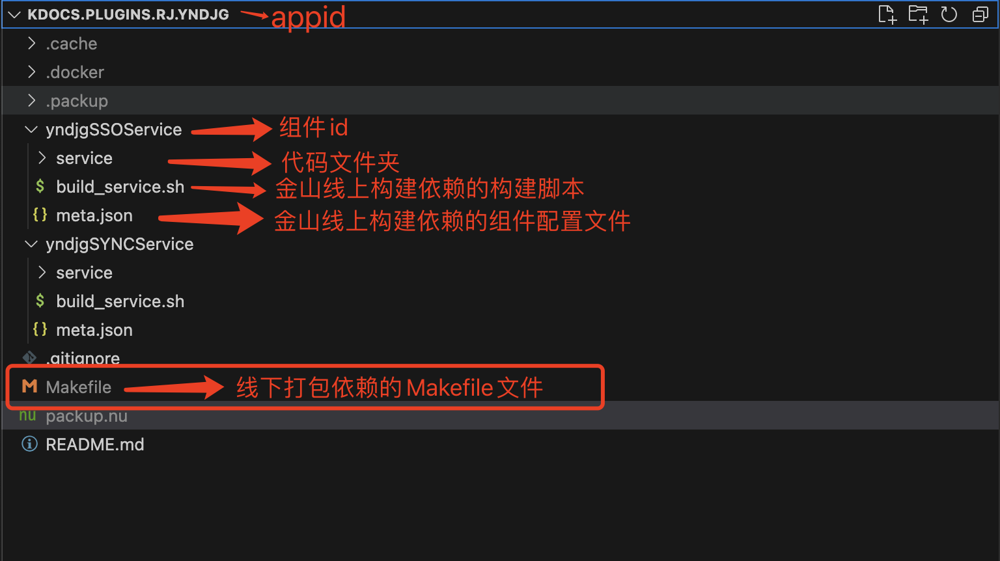

### 金山二开插件线下打包手册（适用于v6和v7版本）

#### 前置条件

1. 安装linux shell 和 GNU make 
2. 本机安装docker环境。 
3. 打包所在目录必须包含在docker的File sharing目录中。


#### 打包过程

1. 项目结构


    标准项目结构如图所示

2. 新建Makefile文件，如上图所示，拷贝以下内容到Makefile文件

    ```shell
    init:
        if ! test -f packup.nu; then docker create --name my_dood yuexclusive/dood:latest; docker cp my_dood:/work/packup.nu packup.nu; docker rm my_dood; fi
        docker run --rm -it --privileged -w /work -v `pwd`:/work -v /var/run/docker.sock:/var/run/docker.sock yuexclusive/dood nu -c "source packup.nu; packup init"
        # nu -c "source packup.nu; packup init"

    packup:
        docker run --rm -it --privileged -w /work -v `pwd`:/work -v /var/run/docker.sock:/var/run/docker.sock yuexclusive/dood nu -c "source packup.nu; packup exec"
        # nu -c "source packup.nu; packup exec"
    ```
3. 使用
   make init
   make packup
    